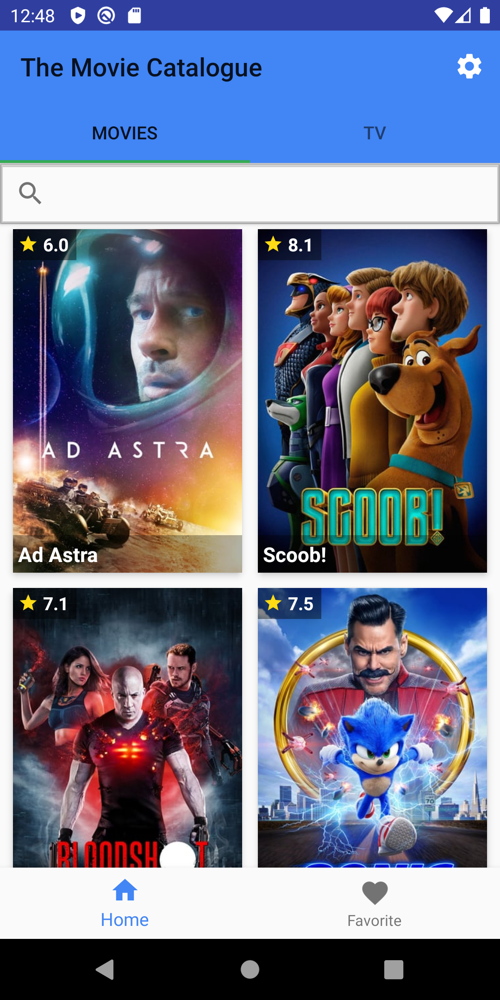
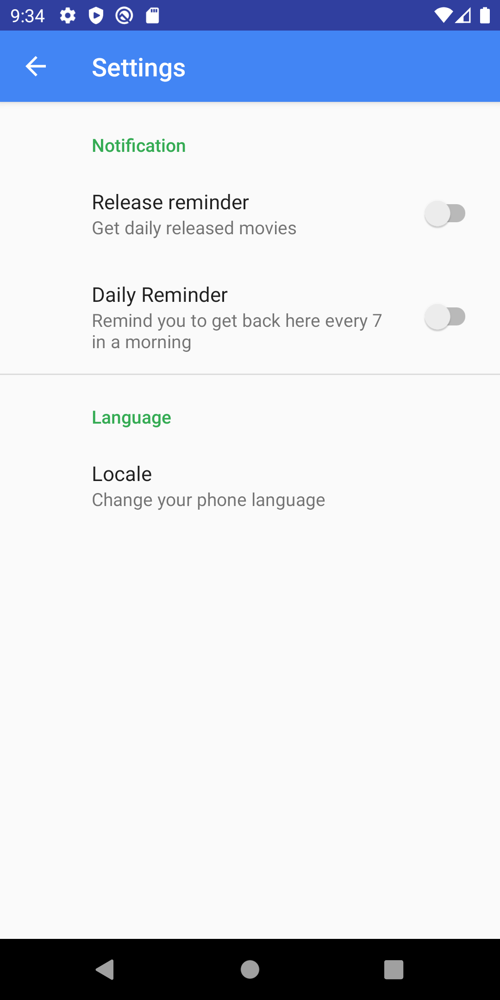
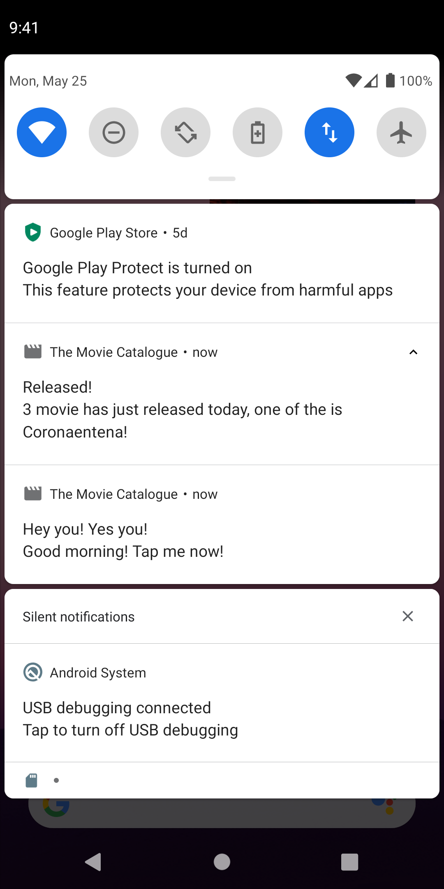

# The Movie Catalogue
A simple Movies Catalogue that provides Movies and Series information based on TMDB. Works both online and offline (favorited
only).
This Repository is my class assignment at Dicoding Indonesia online course platform at class: Menjadi Android Developer Expert (MADE);
Becoming Android Develoepr Expert https://www.dicoding.com/academies/14. I've enrolled in this class as a part of
Google Developers Kejar Indonesia 2019.

## Screenshots
&nbsp;

### App Features
* [x] Fetching movie online from TMDB
* [x] Movie detail
* [x] Movie search
* [x] Mark movies as favorite and get offline access
* [x] Stack widget showing favorited movies
* [x] Include app used to show favorited movies only (need to install the main app first)
* [x] Daily reminder
* [x] Daily new releases notification
* [x] Infinite scroll
* [x] Multi-language available for English and Bahasa Indonesia, based on phone language

### Before Running The App
Go to `gradle.properties` and fill `API_KEY` with your TMDB API key

## Author
* **Muhamad Fahmi Al Kautsar**
